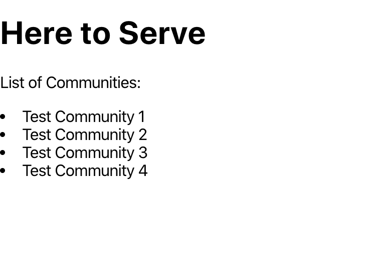

# Here to Serve


## Setting up: Backend

In terminal/command line:

```
$ git clone https://github.com/dzungpng/here-to-serve
$ cd here-to-serve
```

##### Initialize a virtual environment

Windows:

```
$ python -m venv venv
$ venv\Scripts\activate.bat
```

Unix/MacOS:

```
$ python -m venv venv
$ source venv/bin/activate
```

Learn more in [the documentation](https://docs.python.org/3/library/venv.html#creating-virtual-environments).

Note: if you are using a python before 3.3, it doesn't come with venv. Install [virtualenv](https://docs.python-guide.org/dev/virtualenvs/#lower-level-virtualenv) with pip instead.

#### Installing Requirements

Make sure that you are in the here-to-serve base directory. Another way to check is that
when you type ls into terminal, you should see a file called requirements.txt:

```
$ pip install -r requirements.txt
```

This will install all current requirements for the project.

## Setting Up: Frontend
First install ```yarn```. ```yarn``` is a nice package for dependency management. For instructions
on how to install ```yarn```, visit [yarn website](https://classic.yarnpkg.com/en/docs/install).

Then install necessary frontend packages by:

```
$ cd frontend
$ yarn install
```

## Running Project: Backend

#### Migrations

If you just started or cloned the project, have added new models or database tables to the project, or modified any model,
run the following commands to add the changes to the project. Make sure you are in
the same directory as manage.py:

```
$ python manage.py makemigrations
$ python manage.py migrate
```

The reason that there are separate commands to make and apply migrations is because you’ll commit migrations to your version control system and ship them with your app; they not only make your development easier, they’re also usable by other developers and in production.
More info on these commands [here](https://docs.djangoproject.com/en/3.0/ref/django-admin/#django-admin-makemigrations).

#### Creating an admin user (if one isn't created already)

```
$ python manage.py createsuperuser
```

Enter in the admin information. 

#### Running the Project Locally

```
$ python manage.py runserver
```

#### Important Endpoints

- localhost:8000/admin <br />

This endpoint allows you to login as an admin and easily view and update models.
When you have successfully logged in, you should see this view:


- localhost:8000 <br />

You can add communities as an admin directly on this interface. <br />

This endpoint allows you to view the models as a rest API.


## Running Project: Frontend

```
$ cd frontend
$ yarn start
```

If you navigate to localhost:3000, you should see the following view:



These are test communities we added with the admin view. If you want to test further, 
try going to admin view (localhost:8000/admin) and add some more communities.

Note: You have to have both frontend and backend running to run the entire project. 
If you only have the backend running, you can access the admin and API pages. 
